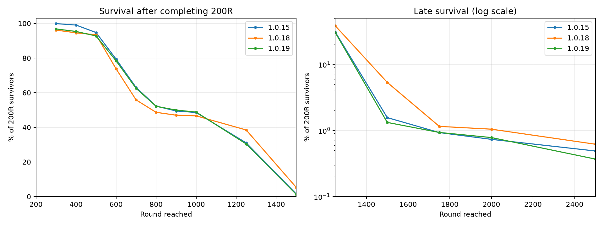
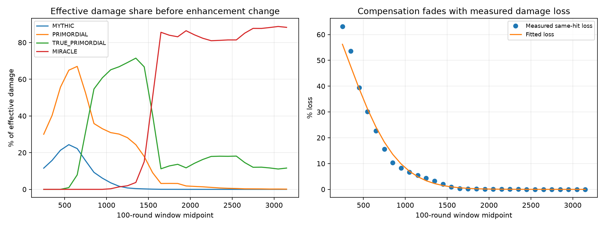

# 1.0.19 — 200R 생존자 기준 후반 곡선 복원

1~200R은 1.0.18을 유지하고, 이후 도달률을 강화 변경 전 1.0.15의 **200R 완료자** 기준에 맞췄다. 도달은 해당 라운드 시작을 뜻한다. 전체 시작 판의 도달률을 1.0.15와 같게 만드는 조정은 아니다.

## 독립 검증

조정에 사용하지 않은 시드 44,000,000~44,008,191로 무특성·최고 4특성 각각 8,192판, 총 16,384판을 처음부터 실행했다. 결과 재사용은 없다. 관측 상한은 10,000R이며 게임의 라운드 제한은 아니다. 기준 1.0.15는 기존 2,048판 자료다. 같은 시드의 직접 비교가 아니므로 표본 변동을 포함한다.

| 라운드 | 1.0.15 | 1.0.19 | 차이(%p) | 1.0.19 95% 구간 |
|---:|---:|---:|---:|---:|
| 300 | 99.902% | 96.825% | -3.077 | 96.278~97.294% |
| 400 | 99.069% | 95.368% | -3.701 | 94.721~95.938% |
| 500 | 94.755% | 92.779% | -1.975 | 91.995~93.492% |
| 600 | 79.412% | 78.425% | -0.986 | 77.213~79.590% |
| 700 | 63.039% | 62.527% | -0.512 | 61.118~63.915% |
| 800 | 52.255% | 52.153% | -0.102 | 50.708~53.595% |
| 900 | 49.461% | 49.978% | +0.517 | 48.534~51.423% |
| 1000 | 48.578% | 48.826% | +0.247 | 47.382~50.271% |
| 1250 | 31.029% | 30.426% | -0.603 | 29.113~31.772% |
| 1500 | 1.569% | 1.327% | -0.242 | 1.034~1.700% |
| 1750 | 0.931% | 0.935% | +0.004 | 0.695~1.257% |
| 2000 | 0.735% | 0.783% | +0.048 | 0.566~1.082% |
| 2500 | 0.490% | 0.370% | -0.120 | 0.231~0.591% |

최고 4특성 기준이며 희귀 후반 도달은 오차가 크다. 구간은 Wilson 95% 신뢰구간으로, 이전 표본에도 불확실성이 있다. 신뢰구간의 중첩 자체가 동등성의 증명은 아니다. 300~400R은 이전보다 약 3~4%p 낮아 완전히 복원되지 않았다. 600~1250R의 차이는 약 1%p 이내다. 특성 이용자의 후반을 우선한 조정이며 무특성의 조건부 곡선까지 동일하게 맞춘 결과는 아니다.



| 조건 | 버전 | 전체 판 | 200R 완료 | 1000R/전체 | 2000R/전체 | 최장 도달 |
|---|---|---:|---:|---:|---:|---:|
| 무특성 | 1.0.15 | 2048 | 338 | 0.000% | 0.000% | 683 |
| 무특성 | 1.0.18 | 8192 | 1681 | 0.098% | 0.000% | 1183 |
| 무특성 | 1.0.19 | 8192 | 1687 | 0.061% | 0.000% | 1144 |
| 최고 4특성 | 1.0.15 | 2048 | 2040 | 48.389% | 0.732% | 3133 |
| 최고 4특성 | 1.0.18 | 8192 | 4674 | 26.611% | 0.598% | 3133 |
| 최고 4특성 | 1.0.19 | 8192 | 4598 | 27.405% | 0.439% | 3094 |

## 피해 측정과 곡선

이전 전투를 타격 단위로 재실행하고, 실제 적용된 피해와 현재 등급·강화 공식으로 같은 타격을 계산한 피해를 비교했다. 초과 피해는 남은 체력으로 잘랐다. 재구성된 실제 피해가 전투 엔진 값과 같고, 계측한 게임의 최종 라운드·틱·구매·판매가 원본과 같은지 검사했다. 이는 같은 타격의 화력 손실 추정이며, 표적 변경·처치 시점까지 다시 계산한 가상 전투는 아니다. 최종 도달률은 별도의 실제 전투 시뮬레이션으로 확인했다.

200~1499R 피해 지분은 첫 512개 시드의 해당 구간 생존자별 비율을 평균했다. 1500R 이상은 이전 2048판·1.0.18 8192판의 생존자를 계측했다. 후반에 표본 구성이 달라지며, 늦은 구간은 표본이 적다. 원시 타격 집계는 old.csv.gz, old-early.csv.gz, current.csv.gz에 보관한다.



200R 이후는 하나의 식으로 계산한다. 기준 성장식 B(r)에 이전 곡선을 근사하는 완만한 보정, 실측 화력 손실 L(r), 초반을 고정했을 때 생기는 조합 성장 지연 G(r)을 함께 반영한다. 500·1000·1500R별 체력값을 직접 입력하지 않는다.

```text
x = r / 1000
B(r) = 146879926.25949115 × x^3.1 × ((1+x²)/2)^1.3
L(r) = 0.7110088784 × exp(-(r/619.4530037)^1.593123948)
A(r) = B(r) × exp(-0.9100461108 × ln(x)/(1+x^19.99999472)) × (1-L(r))
G(r) = exp(|ln(200/277.1763647)/0.5348965926|³ - |ln(r/277.1763647)/0.5348965926|³)
H(r) = A(r) × exp(-ln(A(200)/200000) × G(r))
```

L은 이전 타격 손실 자료를 가중 로그 최소제곱으로 근사했다. 기준식 보정은 1.0.15 체력 곡선에 적합했다. 성장 지연의 폭·중심·형태는 43,000,000부터 1,024개 시드로 A/D/E 후보를 비교하여 D를 선택했다. 공통 도달 구간 600~1250R의 오차를 우선했고 희귀한 2000R 성공 횟수만 맞추지 않았다. 후보 요약과 설정을 함께 보관한다. 전체 곡선의 정확한 계수는 campaign.properties에 있다.

보정은 후반으로 갈수록 사라져 기존의 장기 성장식으로 수렴한다. 1.0.18처럼 무한 구간 전체를 15% 깎지 않는다. 저장 호환성을 위해 계산한 정수 라운드 값을 기존 HealthCurve 형식에 저장한다. 이 값들은 수식의 샘플이며 개별 수동 조정값이 아니다. 10,000R 이후에도 수렴한 같은 성장식이 이어진다.

## 검증 범위와 적용

1~200R 체력과 몹 구성·보상·속도·출현 시점 보존, 증가 곡선 연속성, 이전 보간의 비트 단위 동일성, 설정 재정의, 저장 형식 왕복을 자동 검사한다. 기존/신규 JAR 사이에서 캠페인 직렬화와 HP 해시가 양방향 일치했다. 라이브 안전 리로드를 수행했다는 뜻은 아니다.

타워·강화·뽑기·판매·특성은 이번에 바꾸지 않았다. 진행 중 세션은 저장된 캠페인 설정을 유지하며 새 곡선은 새 세션부터 적용된다. beta 배포 후 로컬·오라클 update 폴더에 준비하고 서버 리로드·재시작은 하지 않는다.

전체 조합이나 실제 이용자의 플레이를 대표하지 않으며 10만 판 검증도 아니다. 무특성 결과와 최고 4특성 결과를 분리해 공개한다. 재현: ProgressionBenchmarkMain 8192 44000000 OUTPUT none,top_fusion_four --threads 12 --cap 10000. 피해 재분석은 benchmarks/balance/analyze_damage_share.py, 이 보고서는 report_smooth_growth.py로 생성한다.
